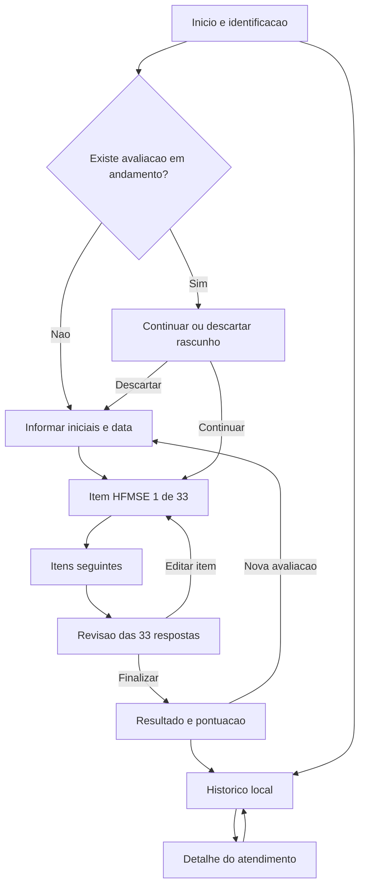

# Mapa de telas - Aplicativo HFMSE

## 1. Visao geral

Aplicativo web responsivo, mobile-first e instalavel como PWA para conduzir um profissional de saude pelos 33 itens da escala HFMSE. O produto funciona sem login e sem backend. As unicas informacoes de identificacao solicitadas sao as iniciais do paciente e a data do atendimento.

As respostas, a pontuacao e o historico de atendimentos concluidos ficam armazenados apenas no navegador e no dispositivo utilizados. Nenhuma informacao deve ser enviada a servidor, ferramenta de analytics ou servico de terceiros.

### Direcao visual

- Clinica, clara, acolhedora e confiavel.
- Cores claras e confortaveis, com contraste acessivel.
- Conteudo centralizado e largura adequada para celular e tablet.
- Botoes e alternativas com areas de toque amplas.
- Hierarquia visual forte para pergunta, instrucoes e resposta.
- Uso de progressive disclosure para evitar apresentar todas as instrucoes extensas de uma vez.

> Nota para o Stitch: a direcao visual deve ser configurada no design system do projeto. Os prompts de tela abaixo descrevem estrutura, conteudo e interacao, sem definir fontes ou codigos de cor.

## 2. Arquitetura da jornada



## 3. Inventario de telas

| ID | Tela | Objetivo principal |
| --- | --- | --- |
| T01 | Inicio e identificacao | Iniciar, retomar ou consultar atendimentos locais |
| T02 | Avaliacao guiada | Apresentar um item da HFMSE por vez e registrar 0, 1 ou 2 |
| T03 | Revisao | Conferir os 33 itens e corrigir respostas |
| T04 | Resultado | Mostrar a pontuacao total e confirmar o armazenamento local |
| T05 | Historico local | Listar atendimentos concluidos neste dispositivo |
| T06 | Detalhe do atendimento | Consultar as respostas e a pontuacao de um atendimento salvo |

## 4. Especificacao das telas

### T01 - Inicio e identificacao

**Objetivo:** iniciar uma nova avaliacao, continuar um rascunho ou acessar o historico local.

**Estrutura:**

1. Cabecalho simples com nome do aplicativo e acesso ao historico.
2. Texto curto explicando que a escala possui 33 itens e deve ser aplicada por profissional capacitado.
3. Aviso persistente: "Os dados ficam somente neste dispositivo".
4. Formulario com:
   - Iniciais do paciente, obrigatorias, normalizadas para maiusculas.
   - Data do atendimento, obrigatoria, preenchida inicialmente com a data atual e sem permitir data futura.
5. Botao primario "Iniciar avaliacao".
6. Botao secundario "Ver historico".

**Validacoes:**

- As iniciais devem conter de 2 a 6 letras. Pontos e espacos podem ser digitados, mas sao removidos ao salvar.
- A data deve ser valida, igual ou anterior a data atual.
- O inicio permanece bloqueado ate os dois campos serem validos.

**Rascunho existente:**

- Exibir um card com iniciais, data e progresso, por exemplo "MAS - 12/08/2026 - 18 de 33 respondidos".
- Oferecer "Continuar avaliacao" e "Descartar e iniciar outra".
- Descartar exige dialogo de confirmacao.

**Estados:** primeira utilizacao, formulario invalido, rascunho existente e falha ao acessar o armazenamento local.

#### Prompt Stitch - T01

```text
Overall Purpose: criar a tela inicial de uma aplicacao clinica simples para iniciar ou retomar uma avaliacao motora HFMSE. A experiencia deve ser calma, acolhedora, focada e apropriada para uso em tablet por um profissional de saude.

PLATFORM: Web responsivo, mobile-first.

PAGE STRUCTURE:
1. Header compacto com o titulo "Avaliacao HFMSE" e um botao secundario "Historico".
2. Introductory card com uma explicacao curta de que a avaliacao possui 33 itens e deve ser realizada por profissional capacitado.
3. Local privacy alert informando que iniciais, data e respostas ficam somente neste dispositivo.
4. Clean form com campo "Iniciais do paciente", date picker "Data do atendimento" e validacao inline.
5. Primary call-to-action button "Iniciar avaliacao" e secondary button "Ver historico".
6. Quando existir rascunho, mostrar um progress card acima do formulario com iniciais, data, quantidade respondida e as acoes "Continuar" e "Descartar".

INTERACTIONS AND STATES: validacao inline, estado inicial, rascunho existente, dialogo de confirmacao para descarte e mensagem de erro do armazenamento local.
```

### T02 - Avaliacao guiada

**Objetivo:** apresentar um unico item por vez e registrar a resposta observada.

**Estrutura:**

1. Cabecalho fixo com iniciais, data e acao "Sair e continuar depois".
2. Indicador "Item N de 33" e barra de progresso.
3. Titulo do criterio.
4. Card principal com a pergunta dirigida ao paciente.
5. Secoes expansveis:
   - Posicao inicial.
   - Posicao final.
   - Instrucao ao examinador.
6. Tres response cards com descricao completa e selo de 2, 1 ou 0 pontos.
7. Cronometro auxiliar somente nos itens que exigem contagem, sem alterar automaticamente a resposta.
8. Barra inferior fixa com "Anterior" e "Proximo".

**Comportamento:**

- A resposta e salva localmente assim que um card e selecionado.
- "Proximo" permanece desabilitado ate haver resposta no item atual.
- Voltar a um item preserva a resposta anterior e permite alteracao.
- O ultimo item direciona para T03.
- Fechar ou recarregar a pagina preserva o rascunho.

**Estados:** sem resposta, respondido, cronometro ativo, salvamento local confirmado e erro de armazenamento.

#### Prompt Stitch - T02

```text
Overall Purpose: criar a tela principal de uma avaliacao clinica guiada, mostrando somente um dos 33 itens HFMSE por vez para reduzir carga cognitiva e evitar erros de pontuacao.

PLATFORM: Web responsivo, mobile-first, otimizado para tablet.

PAGE STRUCTURE:
1. Sticky header com iniciais do paciente, data e acao discreta "Sair e continuar depois".
2. Step indicator "Item 8 de 33" com progress bar horizontal.
3. Criterion title e um prominent question card com a pergunta dirigida ao paciente.
4. Collapsible instruction panels para "Posicao inicial", "Posicao final" e "Instrucao ao examinador".
5. Vertical response card group com tres alternativas completas. Cada card possui um score badge claramente identificado como 2, 1 ou 0 pontos e um radio selection state.
6. Contextual timer control apenas quando o item exigir contagem.
7. Fixed form actions com secondary button "Anterior" e primary button "Proximo".

INTERACTIONS AND STATES: selecao de resposta, resposta previamente marcada, validacao antes de avancar, cronometro, autosave local e mensagem de falha de armazenamento.
```

### T03 - Revisao

**Objetivo:** permitir que o profissional confira a avaliacao antes de conclui-la.

**Estrutura:**

1. Cabecalho "Revisar avaliacao" com iniciais e data.
2. Resumo com quantidade respondida e total parcial, sem interpretacao clinica.
3. Lista numerada dos 33 itens.
4. Cada linha apresenta titulo, resposta selecionada, pontos e acao "Editar".
5. Itens ausentes aparecem no topo e com destaque textual.
6. Botao "Finalizar avaliacao".

**Comportamento:**

- "Editar" abre T02 no item selecionado.
- A finalizacao exige todos os itens respondidos.
- Finalizar abre um dialogo informando que o atendimento sera adicionado ao historico local e nao podera ser editado.

#### Prompt Stitch - T03

```text
Overall Purpose: criar uma tela de revisao clara para conferir todas as respostas HFMSE antes da finalizacao, com identificacao imediata de itens ausentes e acesso rapido para correcao.

PLATFORM: Web responsivo, mobile-first.

PAGE STRUCTURE:
1. Header com titulo "Revisar avaliacao", iniciais e data do atendimento.
2. Summary card com "33 de 33 respondidos" e pontuacao parcial, sem classificacao clinica.
3. Numbered vertical list dos 33 itens. Cada row mostra nome do item, descricao resumida da resposta, score badge e text button "Editar".
4. Missing-answer alert e itens pendentes agrupados no topo quando necessario.
5. Sticky footer com secondary button "Voltar" e primary button "Finalizar avaliacao".

INTERACTIONS AND STATES: lista completa, respostas ausentes, retorno a um item e confirmation dialog antes da finalizacao.
```

### T04 - Resultado

**Objetivo:** apresentar a pontuacao final e confirmar que o atendimento foi salvo localmente.

**Estrutura:**

1. Mensagem "Avaliacao concluida".
2. Iniciais e data do atendimento.
3. Pontuacao em destaque no formato "X de 66 pontos".
4. Texto explicito: "Este resultado nao oferece diagnostico ou interpretacao clinica".
5. Resumo expansivel das 33 respostas.
6. Botoes "Ver historico" e "Nova avaliacao".

**Comportamento:**

- Ao finalizar, o atendimento e incluido uma unica vez no historico local.
- O rascunho correspondente e removido.
- "Nova avaliacao" retorna a T01 com formulario vazio.

#### Prompt Stitch - T04

```text
Overall Purpose: criar uma tela de conclusao serena e objetiva para mostrar a pontuacao total da HFMSE e confirmar o armazenamento do atendimento no dispositivo.

PLATFORM: Web responsivo, mobile-first.

PAGE STRUCTURE:
1. Success heading "Avaliacao concluida" com iniciais e data.
2. Large score card mostrando "42 de 66 pontos" sem percentual, categoria ou interpretacao.
3. Informational alert dizendo que a pontuacao nao representa diagnostico nem recomendacao terapeutica.
4. Collapsible response summary com os 33 itens e seus pontos.
5. Primary button "Nova avaliacao" e secondary button "Ver historico".

INTERACTIONS AND STATES: resultado salvo, resumo expandido ou recolhido e falha de armazenamento com opcao de tentar novamente antes de sair.
```

### T05 - Historico local

**Objetivo:** consultar e excluir atendimentos concluidos no navegador atual.

**Estrutura:**

1. Cabecalho "Historico neste dispositivo" e botao voltar.
2. Aviso de que o historico nao sincroniza, nao possui backup e pode ser perdido ao limpar os dados do navegador.
3. Lista em ordem decrescente de data.
4. Cada card apresenta iniciais, data, pontuacao `X/66` e acao "Ver detalhes".
5. Menu por item com "Excluir atendimento".
6. Acao secundaria "Apagar todo o historico".

**Estados:** lista preenchida, historico vazio, confirmacao de exclusao individual, confirmacao de exclusao total e erro de leitura local.

#### Prompt Stitch - T05

```text
Overall Purpose: criar uma tela simples de historico local para consultar avaliacoes HFMSE concluidas neste dispositivo, deixando claras as limitacoes de armazenamento e privacidade.

PLATFORM: Web responsivo, mobile-first.

PAGE STRUCTURE:
1. Header com back button e titulo "Historico neste dispositivo".
2. Local storage information banner explicando que nao existe sincronizacao ou backup.
3. Reverse chronological card list. Cada card mostra iniciais, data do atendimento, pontuacao de 0 a 66 e button "Ver detalhes".
4. Overflow menu em cada card com destructive action "Excluir atendimento".
5. Secondary destructive action "Apagar todo o historico" no final da pagina.
6. Empty state com mensagem "Nenhum atendimento salvo neste dispositivo" e botao "Iniciar avaliacao".

INTERACTIONS AND STATES: lista, estado vazio, dialogo de exclusao individual, dialogo de exclusao total e erro de armazenamento.
```

### T06 - Detalhe do atendimento

**Objetivo:** consultar um atendimento finalizado sem permitir alteracoes.

**Estrutura:**

1. Cabecalho com voltar e titulo "Detalhe do atendimento".
2. Card com iniciais, data e pontuacao total.
3. Lista dos 33 itens com resposta escolhida e pontos.
4. Aviso "Registro armazenado somente neste dispositivo".
5. Acao "Excluir atendimento".

**Comportamento:**

- O atendimento concluido e somente leitura.
- A exclusao exige confirmacao e nao pode ser desfeita.

#### Prompt Stitch - T06

```text
Overall Purpose: criar uma tela de consulta somente leitura para um atendimento HFMSE armazenado localmente, com pontuacao e detalhamento completo das respostas.

PLATFORM: Web responsivo, mobile-first.

PAGE STRUCTURE:
1. Header com back button e titulo "Detalhe do atendimento".
2. Summary card com iniciais, data e pontuacao total "42 de 66 pontos".
3. Read-only accordion list com os 33 itens, descricao da resposta selecionada e score badge.
4. Local-only information note.
5. Destructive text button "Excluir atendimento".

INTERACTIONS AND STATES: itens expandidos ou recolhidos, dialogo de exclusao e retorno ao historico depois da exclusao.
```

## 5. Componentes compartilhados

- `AppHeader`
- `LocalDataNotice`
- `ProgressIndicator`
- `InstructionAccordion`
- `ScoreOptionCard`
- `ContextTimer`
- `AssessmentSummaryRow`
- `HistoryCard`
- `ConfirmationDialog`
- `StorageErrorAlert`
- `StickyFormActions`

## 6. Estados globais e mensagens

| Situacao | Mensagem e resposta da interface |
| --- | --- |
| Armazenamento indisponivel | Informar que o navegador bloqueou o armazenamento e que o progresso pode ser perdido |
| Rascunho encontrado | Oferecer continuar ou descartar, sem iniciar outro silenciosamente |
| Resposta ausente | Manter o avanco bloqueado e levar foco para as alternativas |
| Historico vazio | Explicar que nenhum atendimento foi concluido neste dispositivo |
| Registro inexistente | Retornar ao historico com aviso de que o atendimento nao foi encontrado |
| Exclusao | Exigir confirmacao e explicar que nao existe recuperacao ou backup |
| Versao incompatível | Preservar o dado bruto quando possivel e oferecer limpeza segura, sem tentar pontuar dados desconhecidos |

## 7. Fora da jornada

- Login ou perfis de usuario.
- Cadastro com nome completo ou prontuario.
- Backend, banco de dados remoto ou sincronizacao.
- Exportacao para PDF.
- Compartilhamento por e-mail ou mensageria.
- Interpretacao clinica, diagnostico ou recomendacao terapeutica.

